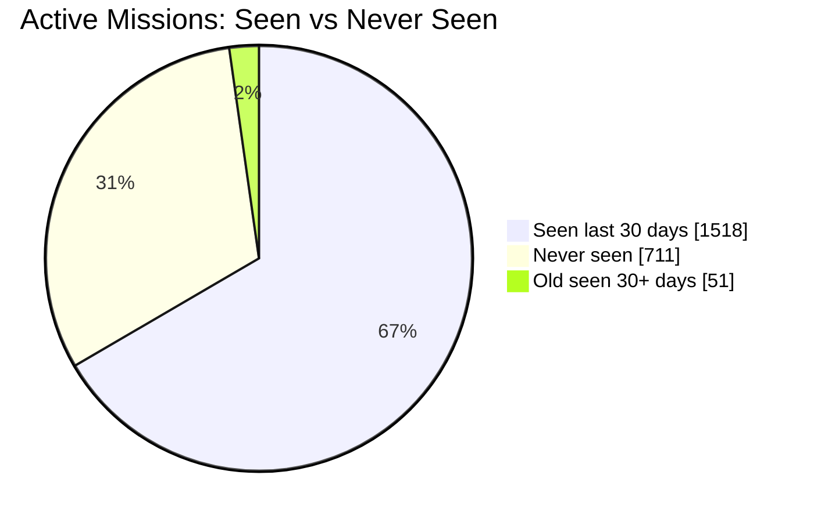
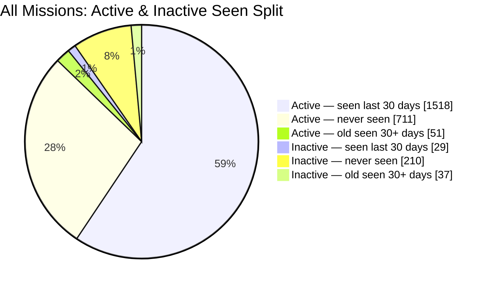

# Active Missions Report

This README is auto-updated by scripts/main.py and the GitHub workflow.

## Summary

### Overall Metrics

| Metric | Value |
| --- | ---: |
| Total missions | 2556 |
| Active missions | 2280 |
| Inactive missions | 276 |
| Missions seen in last 30 days | 1547 |

### Never-Seen Breakdown

| Metric | Value |
| --- | ---: |
| Never seen missions (total) | 921 |
| Never seen active missions | 711 |
| Never seen inactive missions | 210 |

### Old-Seen Breakdown (30+ days)

| Metric | Value |
| --- | ---: |
| Old seen missions (older than 30 days) | 88 |
| Old seen active missions | 51 |
| Old seen inactive missions | 37 |

### Active Missions Seen Split

### All Missions Overview

## Generated Files

- data/inzetten.json
- data/missions_log.json
- data/inzetten_ids.json
- never_seen_missions_summary.md (active and inactive sections)
- old_seen_missions_summary.md
- event_missions.md
- missions_seen_last_30_days_grouped.md (generated only between 23:00 and 23:59 Dutch time)
- missions_grouped_by_category.md (generated only between 23:00 and 23:59 Dutch time)
- missions_grouped_by_requirement.md (generated only between 23:00 and 23:59 Dutch time)

## Workflow Windows

- The weekly totals Discord summary runs only on Monday between 08:00 and 08:59 Dutch time (Europe/Amsterdam).
- The grouped recent-seen overview script runs only between 23:00 and 23:59 Dutch time (Europe/Amsterdam).
- The category-grouped and requirement-grouped scripts run only between 23:00 and 23:59 Dutch time (Europe/Amsterdam).
- Outside that window, missions_seen_last_30_days_grouped.md is not regenerated by the workflow.
- Outside that window, missions_grouped_by_category.md and missions_grouped_by_requirement.md are not regenerated by the workflow.

## Discord Notifications

The script sends automated notifications to Discord when mission statuses change. Messages are batched to respect Discord's character limits.

| Notification Type | Emoji | Color | Trigger | Format |
| --- | --- | --- | --- | --- |
| **Newly Discovered** | ✨ | 🟦 Cyan (16776960) | Never-seen missions detected for the first time | Batch message with all new missions |
| **Never→Active** | 🎯 | 🟨 Yellow (65535) | A never-seen mission gets its first activity | Batch message with transitions |
| **Not Seen 30+ Days** | 🚨 | 🔴 Red (16711680) | Mission hasn't been seen in 30+ days | Batch message with stale missions |
| **Back to Activity** | ✅ | 🟢 Green (65280) | Previously inactive mission (30+ days) is active again | Batch message with resumed missions |
| **Active→Inactive** | ⏸️ | 🟠 Orange (16098851) | Mission date window moved outside active period | Batch message with state changes |
| **Inactive→Active** | ▶️ | 🟩 Green (5763719) | Mission date window re-entered active period | Batch message with state changes |
| **Weekly Totals** | 📊 | 🔵 Blue (3447003) | Monday 08:00-08:59 Dutch time | Single summary message with totals |

### Message Format

- **Batch messages** (Newly Discovered, Never→Active): Compact format listing multiple missions with ID, name, and credits
  - Example: `101: Mission Name (500 cr)`
  - Automatically splits into multiple messages if exceeding 2000 characters (Part 1/X, Part 2/X, etc.)

- **Batch messages** (Not Seen 30+ Days, Back to Activity): Compact format listing multiple missions
  - Shows: Mission ID, name, and average credits

- **Weekly totals message**: Single summary with total counts
  - Shows: Active missions, Inactive missions, Seen last 30 days, Not seen
  - Seen last 30 days includes percentage of active missions in parentheses
